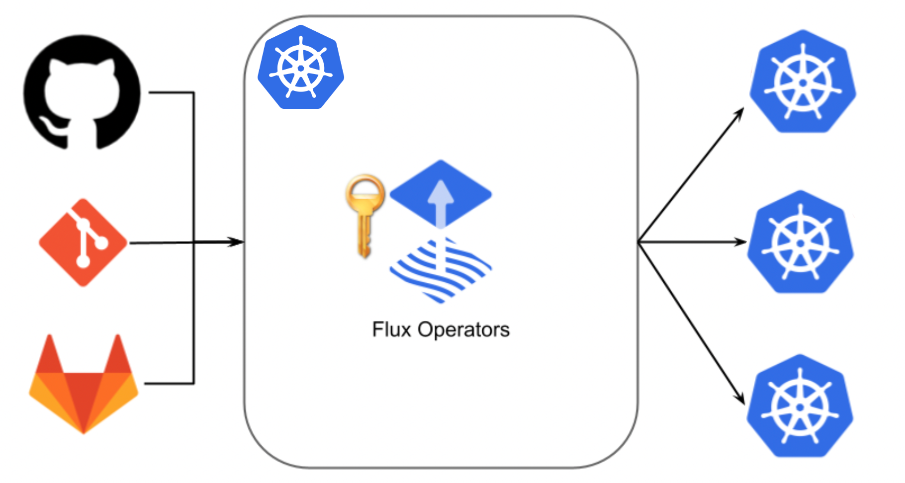
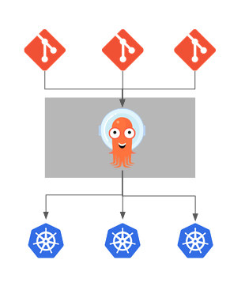

# Continuous Deployment on Kubernetes: What’s the Difference Between Argo CD and FluxCD

If you’ve heard of GitOps and its benefits, you may have come across two open source projects in the Cloud Native Computing Foundation: Argo CD and FluxCD. Members of these projects are involved in the CNCF’s OpenGitOps initiative, and both are incubating projects. With GitOps, you increase reliability and velocity, lower downtime, and can enjoy other benefits through key GitOps capabilities such as reconciliation.

When building out a Kubernetes cluster, the actual pipelines for the code behind applications is just as important as the firewalls, load balancers and provisioning systems at the front. There are many ways to build out application CI/CD pipelines in Kubernetes, but in this article, we are going to focus very specifically on two options for Continuous Deployment: [Flux CD](https://fluxcd.io/) (specifically Flux v2) and [Argo CD](https://argoproj.github.io/cd/).

Below are the results of exploring the differences between these two projects. Both have their uses, and both are quite well maintained and have active communities. This article will focus on those areas where the two differ, rather than on the overall CD landscape in which they exist.

This article was written with the guidance of the [GitOps Working Group](https://github.com/gitops-working-group/gitops-working-group).

# Current Landscape

<table>
  <tr>
   <td>
   </td>
   <td>Flux CD
   </td>
   <td>Argo CD
   </td>
  </tr>
  <tr>
   <td>CNCF Status:
   </td>
   <td><a href="https://www.cncf.io/projects/">Incubating</a>
   </td>
   <td><a href="https://www.cncf.io/projects/">Incubating</a>
   </td>
  </tr>
  <tr>
   <td>Public references:
   </td>
   <td><a href="https://fluxcd.io/adopters/">30</a>
   </td>
   <td><a href="https://github.com/argoproj/argo-cd/blob/master/USERS.md">176</a>
   </td>
  </tr>
  <tr>
   <td>Contributing companies:
   </td>
   <td><a href="https://flux.devstats.cncf.io/d/7/companies-contributing-in-repository-groups?orgId=1&var-period=d28&var-repogroup_name=fluxcd%2Fflux2">14 on average</a>
   </td>
   <td><a href="https://argo.devstats.cncf.io/d/7/companies-contributing-in-repository-groups?orgId=1&var-period=d28&var-repogroup_name=argoproj%2Fargo-cd">90 on average</a>
   </td>
  </tr>
  <tr>
   <td>Notes:
   </td>
   <td>
<ul>

<li>Flux CD is in the process of graduation from CNCF

<li>Flux has recently <a href="https://fluxcd.io/blog/2021-11-10-flux-security-audit/">completed a security audit </a>commissioned by the CNCF. They are expected to graduate very soon.
</li>
</ul>
   </td>
   <td>
<ul>

<li>Argo CD currently holds <a href="https://thenewstack.io/argocd-gets-devsecops-nod-with-cncf/">“adopt” status in DevSecOps from the CNCF</a> 

<li>Argo CD is expected to graduate in EOCY 2022

<li>Argo CD has undergone <a href="https://github.com/argoproj/argoproj/blob/master/docs/argo_security_final_report.pdf">an independent security audit</a> to comply with the latest security standards
</li>
</ul>
   </td>
  </tr>
</table>

# Installation/Bootstrapping

Both Flux and Argo need to be installed on the cluster you want to manage. Once installed, they need to be configured to read YAML files from a Git repository. This initial configuration step is called "bootstrapping". Flux and Argo have different paradigms to installing/bootstrapping.

## Flux CD

FluxCD [installation/bootstrapping](https://fluxcd.io/docs/cmd/flux_bootstrap/) mechanism can be done together. The prerequisites for bootstrapping can be found in the [upstream documentation](https://fluxcd.io/docs/get-started/). During bootstrapping, Flux will create a repository on GitHub or GitLab (A generic “git” mode can also be used) and then create all the manifests for installation and connection to the git repo in that same git repo. The Flux installer will then “hand off” the responsibility of managing/syncing the cluster to the_ flux-system_ that is installed on the cluster, pointing to the repo that was just created.

Flux can also be installed by [just using manifests](https://fluxcd.io/docs/installation/#dev-install), for those that don’t want to use bootstrapping.

## Argo CD

Argo CD has no native mechanism for bootstrapping. The [install](https://argo-cd.readthedocs.io/en/stable/getting_started/#1-install-argo-cd) is just that: the install of the Argo CD components. It leaves the rest of the configuration up to the end user. The install is straightforward. It is done via a YAML file using the `kubectl apply` command on said YAML files. Once Argo CD is installed, it’s ready to be configured and used.

There is a project called “[Argo CD Autopilot](https://github.com/argoproj-labs/argocd-autopilot)” upstream, which is used to bootstrap Argo CD onto a cluster. It also takes an opinionated approach to how your git directory structure should look like. This is an open source project created by [Codefresh](codefresh.io/).

# Reconciliation Configurability

Both projects offer a way to configure how reconciliation works. In this section we’ll focus specifically on the differences between configuring the reconciliation time.

## FluxCD

Flux v2 is built on the [GitOps Toolkit](https://fluxcd.io/docs/components/), which has different components. The Flux reconciliation loop can be configured at each [component](https://fluxcd.io/docs/components/). For example you can have your git repository checked every 5 minutes, but then do the sync every 10 minutes. This gives you the ability to stagger how the reconciliation happens.

## Argo CD

Argo CD reconciliation is a global setting. This is one setting that can be modified via the [Argo CD configuration ConfigMap](https://github.com/argoproj/argo-cd/blob/master/docs/operator-manual/argocd-cm.yaml#L240). By default, this is set to 3 minutes and can be changed by the end user. Although you have a choice of disabling reconciliation globally or per-application, you can only set the reconciliation time globally. This means you cannot set the reconciliation time differently for each [Application](https://argo-cd.readthedocs.io/en/stable/core_concepts/).

# Application Delivery

Both tools support raw Kubernetes manifests (YAML), Kustomize and Helm. Each tool approach is a little different, however. There are other templating mechanisms, like Jsonnet for example. We will focus on the two most popular ones which are Kustomize and Helm.

## FluxCD

Raw Kubernetes YAML:

Flux uses Kustomize heavily. Its[ Kustomize Controller](https://fluxcd.io/docs/components/kustomize/) renders and applies all of the manifests that Flux syncs from the source repository, even when using Raw Kubernetes YAML. Flux will create a `kustommization.yaml` file “on the fly”, if Kustomize wasn’t detected.

When you first bootstrap Flux onto your cluster, it does so by using a Kustomized application called “flux-system” that serves as an entry point for deploying other resources. This entrypoint does a sort of an “autodiscovery” of other YAMLs by doing a Kustomize recursive search in the directory (this is on by default). All someone has to do is create a directory with some YAML, and Flux will “auto detect” it and apply it to the cluster. However, there is no builtin mechanism for ordering. The end user must wait for subsequent reconciliation loops to get a successful application.

Helm:

Flux also has native support for Helm. Its Helm Controller manages all the Helm charts you want to deploy onto the cluster. Unlike Argo (see below), Flux uses the native Helm golang library to deploy a Helm release onto the cluster. This means that someone can run `helm ls` on the cluster, and it’ll appear as if someone ran `helm install` for the given release. The same issue of “ordering” exists with the Flux CD Helm Controller, however; so a user will still need to use Kustomize, even with their helm charts. You also get the advantage of[ Helm’s Chart Hooks](https://helm.sh/docs/topics/charts_hooks/) for ordering. If you are using a hub/spoke model (more on multi cluster later), you can also see Helm charts installed on other clusters.

Things to Note:

Both the Flux Helm Controller and Kustomize Controller CRDs define a _DependsOn_ attribute. That lets you specify dependencies between HelmRelease CRDs, or between Kustomization CRDs, but you can’t currently make a _Kustomization_ depend on a _HelmRelease_. And, although _DependsOn_ enables you to control the load order of collections/groups of YAML files, it does not control the order in which individual YAML files are applied.

## Argo CD

Raw Kubernetes YAML:

Argo CD also supports Kustomize and raw Kubernetes YAML. It can, however, apply raw YAML files directly, without using Kustomize. This can have side effects of Argo CD Applications not syncing right aways as resources need to be reapplied in a retry ([which can be set up per Application](https://github.com/argoproj/argo-cd/blob/master/docs/operator-manual/application.yaml#L111-L116)), or use ordering built into Argo CD. Argo CD does the equivalent of `kubectl apply -f` or a `kustomzie build` if Kustomize is detected. This is by design as the Argo CD creators wanted to emulate the `kubectl` client as closely as possible.

Helm:

Argo CD also has support for Helm, but approaches it in a different way. Argo CD does not use the Helm golang library directly, but instead, uses helm to render the template files and pipes them directly to `kubectl`. Helm chart hooks are converted into Argo CD Syncwaves/Hooks (more on this next) where it can.This has the side effect of users not being able to use the `helm` cli against the cluster because `helm install` wasn’t called in the first place (i.e. `helm ls `will return empty). 

Things to Note:

Argo CD can do “auto discovery” with Kustomize like Flux does by setting it in the sync settings. This isn’t the default, but can be configured by the user

With Argo CD you have more control over ordering of individual resources (i.e. specific YAML file) with [Syncwaves and Phases](https://argo-cd.readthedocs.io/en/stable/user-guide/sync-waves/). This allows you to apply each YAML manifest one at a time. Using Syncwaves and Phases, Argo CD will wait until one YAML is applied (and healthy) before moving onto applying the next one. 

There is a controller that supplements Argo CD’s Application controller called [Application Sets](https://github.com/argoproj-labs/applicationset). This add-on lets users deploy many Applications across one or many managed clusters.

# Secrets Management

GitOps practice of storing the source of truth in git, has had some contention with respect to storing [Kubernetes Secrets](https://kubernetes.io/docs/concepts/configuration/secret/). This has to do with the fact that Secrets often contain sensitive 	information like passwords or tokens, and these secrets are only encoded.

Both Flux and Argo CD have mechanisms in place to handle the encrypting of secrets.

## FluxCD

FluxCD provides a guide for managing encrypted secrets with [Mozilla SOPS](https://fluxcd.io/docs/guides/mozilla-sops/) or [Sealed Secrets](https://fluxcd.io/docs/guides/sealed-secrets/) so that Kubernetes secrets can be stored safely in Git, secured by any of OpenPGP, AWS KMS, GCP KMS and Azure Key Vault. Flux’s Kustomization objects natively support decrypting Mozilla SOPS secrets.

## Argo CD

Argo CD can also [integrate with a variety of Secret management tools](https://argo-cd.readthedocs.io/en/stable/operator-manual/secret-management/) to store these secrets in Git, safely. It leaves this choice up to the user. Some users have taken advantage of Argo CD’s plugin feature to create plugins, for example, the[ Argo CD Vault Plugin](https://github.com/IBM/argocd-vault-plugin). This “hands off” approach just treats secrets as another _Application_ in the cluster.

# Webhook receivers

Webhooks can be used to help with immediate reconciliation with traditional, event driven, workflows. This doesn’t take the place of the reconciliation loop, but rather acts as an “on demand” reconciliation if you don’t want to wait after making a commit to a repo.

The two tools have similar approaches so we just highlight where to get more information.

## FluxCD

FluxCD includes support for incoming webhooks that make GitOps pull-based pipelines as fast and responsive as push-based pipelines. [Webhook receivers](https://fluxcd.io/docs/guides/webhook-receivers/) can notify the Flux controllers about changes in Git or Helm repositories, or other sources like Image Repositories.

## Argo CD

Argo CD also has a mechanism to receive [Webhooks](https://argo-cd.readthedocs.io/en/stable/operator-manual/webhook/) to shorten the time it takes to check for updates to a Git repository. Normally this is done every 3 minutes.

# Alerting and notifications

This is another area where both tools are very similar, so we will just focus on the specific implementations.

## FluxCD

FluxCD controllers emit events when resource statuses change, as new app versions are deployed, and when health checks pass or fail. [Alerting and outgoing notifications](https://fluxcd.io/docs/guides/notifications/) are configured with a Provider resource that connects outgoing webhooks, so Flux can provide status updates through different reporting channels such as Slack or embedded in Git Commit status checks.

## Argo CD

Argo CD uses a separate controller for alerting/notifications called [Argo CD Notifications](https://argocd-notifications.readthedocs.io/en/stable/). With Argo CD Notifications, a user can similarly set up providers and outgoing notifications to systems (like Slack or Pagerduty) altering of a specific event that occurred or if a sync failed or not. This project is[ in the process of being moved](https://github.com/argoproj-labs/argocd-notifications#argo-cd-notifications-is-now-part-of-argo-cd) into the main Argo CD codebase and will be part of the “core” Argo CD offering in future releases

# Image updates automation

Image updating is the process of notifying the GitOps controller that a new image has been created and pushed into a repository. This helps in expediting the process of rolling out new versions of applications.

## FluxCD

FluxCD has a built-in feature called [Image Update Automation](https://fluxcd.io/docs/guides/image-update/), which can be configured to scan for new container images in image repositories that are used by applications in the cluster. FluxCD directly enters the new version into an existing YAML manifest in the form of a git commit.

## Argo CD

Argo CD uses a separate controller called the ["Argo CD Image Updater"](https://argocd-image-updater.readthedocs.io/en/stable/), which takes a similar approach of “writing back” image updates to the YAML manifest in the git repository. The image updater will do this in the form of a[ Kustomize image update](https://github.com/kubernetes-sigs/kustomize/blob/master/examples/image.md). Currently, the tool will only work if you’re using Kustomize or Helm, not not raw (non-kustomized) YAML files.

# Web UI

A Web UI doesn’t change the functionality of either tool, but it’s worth noticing the differences as Flux CD doesn’t have a UI and Argo CD does. Here we just called out the differences and notable information.

## FluxCD

Flux CD, by itself, does not have a Web UI. There is an [experimental UI ](https://github.com/fluxcd/webui)that was started about a year ago, but nothing official. There are opensource platforms, like [Weave GitOps Core](https://github.com/weaveworks/weave-gitops) that are based on Flux and have a UI. But the upstream Flux project currently does not have a UI.

## Argo CD

Argo CD has a rich UI and is very UI centric. Argo CD was built with the UI in mind, so it’s been there from the beginning. It also integrates with Argo CD’s ACL Policies (more on that next) and has the ability to show a “read only” dashboard. This is included “out of the box” with Argo CD, or it can be disabled by installing [Argo CD Core](https://argo-cd.readthedocs.io/en/stable/operator-manual/installation/#core).

# RBAC

With RBAC, each tool not only takes a different technical approach, but also a different philosophical approach. \

## FluxCD

Flux relies strictly on the RBAC capabilities of Kubernetes, and does not manage its own users, permissions, identity, authentication or authorization. There are no “flux users” or “flux admins”. Flux’s permissions are limited by the Role bound to the ServiceAccount it runs as. This is by design. Flux tries to conform to Kubernetes practices of least privilege for the Service Account.

## Argo CD

Argo CD has an[ ACL based RBAC](https://argo-cd.readthedocs.io/en/stable/operator-manual/rbac/), independent of Kubernetes. Argo CD also has a separate group/user mechanism, which is also independent of Kuberenetes. Normally, a user sets up Argo CD’s **_ServiceAccount_** with full admin, and manages users using Argo CD’s user/group mechanism. Or a user can use a combination of the two to get the desired outcome.

The RBAC/Access system on Argo CD is very granular. Although it can be complex to set up, it is very flexible. The Argo CD authentication mechanism can be integrated with[ any provider that supports OIDC](https://argo-cd-docs.readthedocs.io/en/latest/operator-manual/sso/) or brokers it using Dex.

# Multi Cluster

Multi-cluster management is a challenge. Good news; both tools can help with multi-cluster management and deployment of your workloads to different clusters you may have. Both tools have similar models but different implementations.

## FluxCD

FluxCD has the concept of connecting to the remote clusters via Kustomization’s (and HelmRelease’s) _KubeConfig_ setting. FluxCD uses a “pull-based” design, where there needs to be an instance of FluxCD running inside of each cluster. A centralized “management cluster” is another possible configuration, where one Flux instance manages workloads on many clusters. “Multi Cluster '' is achieved through [design and process](https://github.com/fluxcd/flux2-multi-tenancy), via a reference architecture. [Other tools, like CAPI, need to be brought in](https://www.youtube.com/watch?v=7W27tAv7Tvs), to install and manage the clusters.

FluxCD supports multi-cluster management with a single Flux instance by setting [KubeConfig](https://fluxcd.io/docs/components/kustomize/kustomization/#specification) setting. FluxCD also allows the "push" behaviour in this sense by connecting and deploying YAMLS to target clusters via KubeConfig.

Without having the concept of clusters built into Flux directly, Flux can work through a common interface for remote clusters that any Cluster API providers as well as Crossplane would satisfy.

## Argo CD

Argo CD can be configured in a “pull” (instance of Argo CD on each cluster) or “push” (one Argo CD instance connecting to many clusters). Argo CD has a native concept of [clusters](https://argo-cd.readthedocs.io/en/stable/operator-manual/declarative-setup/#clusters). A user can install a central “hub” Argo CD instance and connect many clusters to it (without having the need to install Argo CD in every cluster). Here is a sample design.

Argo CD cannot install clusters, however. Argo CD can only manage and deploy to them. Just like Flux, another tool must be used (Examples include: [Open Cluster Management](https://open-cluster-management.io/), CrossPlane, or CAPI).
